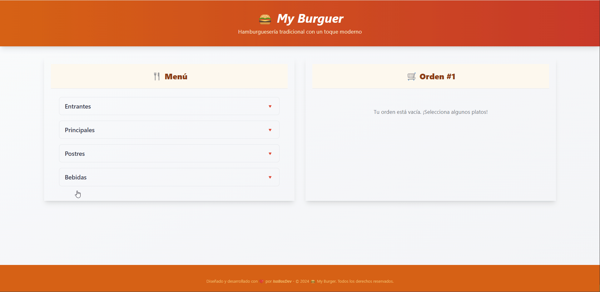

---

# 🍔 My Burger - Aplicación de Pedidos para Hamburguesería

**My Burger** es una aplicación de pedidos para una hamburguesería, desarrollada con **React** y **TypeScript**. Este proyecto forma parte de mi portafolio y combina tecnologías modernas para ofrecer una experiencia de usuario intuitiva y eficiente. La aplicación permite a los usuarios explorar el menú, crear su orden y ajustar propinas, con una interfaz responsiva y optimizada para distintos dispositivos.

## 📽️ La aplicación

> ### [🌐 Visita la aplicación en producción](https://lucky-pie-92ac46.netlify.app/)

---

## 📋 Descripción

**My Burger** es una aplicación interactiva de pedidos para una hamburguesería que permite a los usuarios explorar un menú dinámico y realizar pedidos fácilmente. La aplicación cuenta con:

- Menú con categorías y funcionalidad de acordeón para ver los platos principales, postres y bebidas.
- Resumen de orden donde el usuario puede ver su selección, modificar cantidades y añadir propinas.
- Diseño completamente responsive, que asegura una experiencia óptima en dispositivos móviles y de escritorio.

---

## 🛠️ Tecnologías Utilizadas

Para este proyecto, se han utilizado las siguientes tecnologías:

- **Vite** ⚡ como herramienta de construcción para optimizar el desarrollo.
- **React** ⚛️ para la creación de componentes y la estructura general de la aplicación.
- **TypeScript** 📝 para mejorar la seguridad del código y facilitar su mantenimiento.
- **Tailwind CSS** 🎨 para un diseño rápido y responsivo.
- **Netlify** ☁️ para el despliegue de la aplicación y asegurar un acceso rápido y fiable.

---

## 📈 Funcionalidades

- **Visualización de Menú**: El menú se organiza en categorías que el usuario puede expandir para ver los platos disponibles.
- **Gestión de Orden**: Los usuarios pueden añadir y eliminar artículos de su orden, así como ver el total de la compra.
- **Propinas Dinámicas**: Selección rápida de porcentajes de propina, que se añaden al total.
- **Responsive Design**: Optimización para que la aplicación funcione bien en cualquier dispositivo, desde móviles hasta pantallas grandes.

---

## 📜 Licencia

Este proyecto está licenciado bajo la Licencia MIT.
